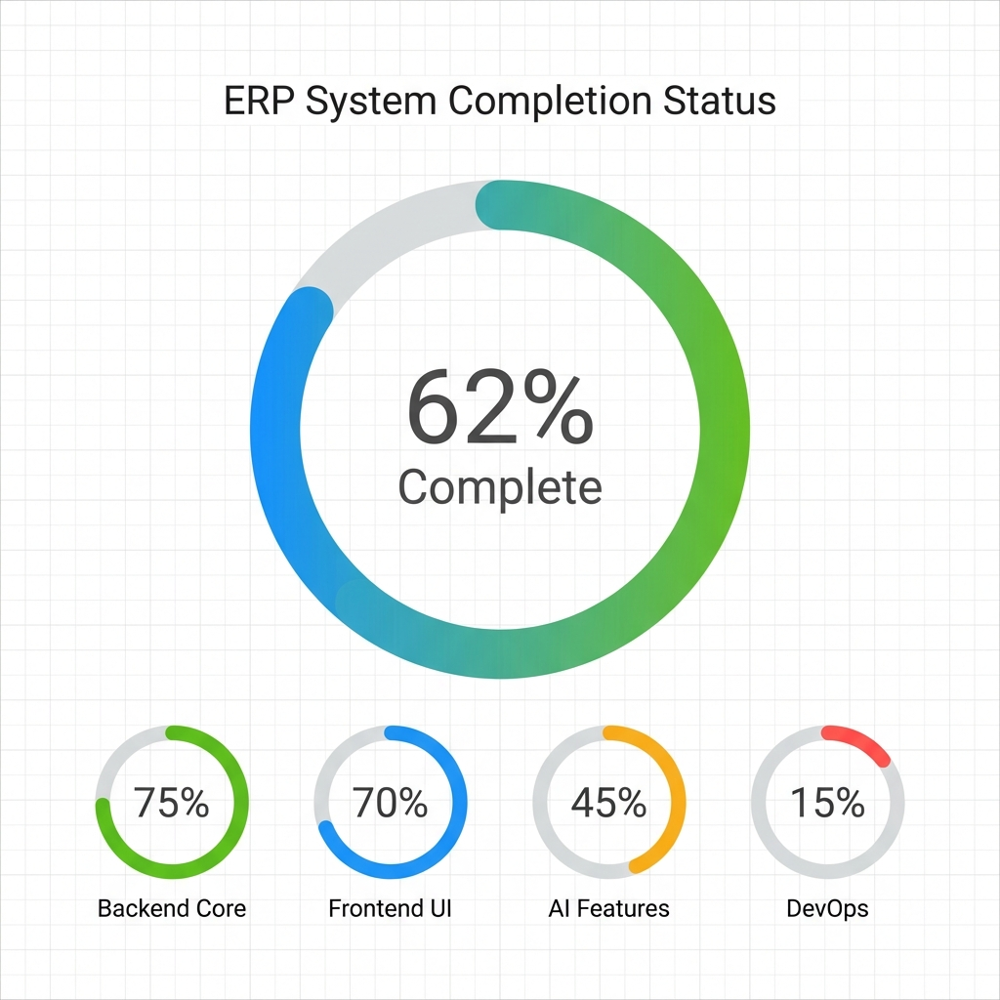

# 🎮 Game Studio ERP System

A comprehensive Enterprise Resource Planning (ERP) system specifically designed for game development studios. Built with modern technologies and best practices for scalability, real-time collaboration, and AI-powered insights.

[](https://github.com)
[](./docs/visual_summary.md)
[](LICENSE)

---

## 🚀 Features

### ✅ Implemented (72% Complete)

#### Core Modules

- **Authentication & Authorization** - Role-based access control (Admin, Manager, Developer, Artist, QA)
- **Project Management** - Create and manage game projects with budgets and milestones
- **Task Management** - Kanban board with drag-and-drop, priority levels, story points
- **Sprint Management** - Agile sprint planning with velocity tracking
- **Asset Management** - Version control for 3D models, textures, audio, and more
- **Bug Tracking** - Severity-based bug management with assignment workflow
- **Time Tracking** - Log billable and non-billable hours per task
- **Activity Logs** - Complete audit trail of all system actions
- **Notifications** - Real-time WebSocket notifications

#### AI-Powered Features

- **Story Point Estimation** - AI suggests effort estimates for tasks
- **Sprint Risk Prediction** - Predict deadline risks based on velocity
- **Capacity Planning** - AI-recommended sprint capacity
- **Asset Reuse Detection** - Identify reusable assets across projects

#### Infrastructure

- **Docker Support** - Full containerization for development and production
- **PostgreSQL** - Production-grade database
- **Redis & Celery** - Async task processing and caching
- **Django Channels** - Real-time WebSocket support
- **Environment-based Config** - Secure secrets management

### 🚧 In Progress

- HR Management Module
- Finance & Payroll Module
- File Upload & Storage (S3 integration)
- Comprehensive Testing Suite
- CI/CD Pipeline

---

## 🛠️ Tech Stack

### Backend

- **Framework:** Django 5.2.10
- **API:** Django REST Framework 3.16.1
- **Authentication:** JWT (SimpleJWT)
- **Database:** PostgreSQL 15 (SQLite for development)
- **Cache/Queue:** Redis 7 + Celery 5.3
- **WebSocket:** Django Channels 4.0
- **ML:** scikit-learn, pandas, numpy

### Frontend

- **Framework:** Next.js 16.1.4 (App Router)
- **Language:** TypeScript 5.x
- **State Management:** Redux Toolkit 2.11.2
- **API Client:** RTK Query
- **UI Library:** Ant Design 6.2.1
- **Styling:** Tailwind CSS 4.x
- **Charts:** Recharts 3.7.0
- **Animations:** Framer Motion 12.28.1

### DevOps

- **Containerization:** Docker + Docker Compose
- **Process Manager:** Celery Beat (scheduled tasks)
- **Testing:** pytest, Jest
- **Code Quality:** flake8, black, ESLint

---

## 📦 Quick Start

### Prerequisites

- Python 3.10+
- Node.js 20+
- Docker & Docker Compose (recommended)
- PostgreSQL 15+ (if not using Docker)
- Redis 7+ (if not using Docker)

### Option 1: Docker (Recommended)

```bash
# Clone the repository
git clone <repository-url>
cd erp-system

# Create environment file
cp backend/.env.example backend/.env

# Edit .env with your configuration
nano backend/.env

# Start all services
docker-compose up --build

# In a new terminal, run migrations
docker-compose exec backend python manage.py migrate

# Create superuser
docker-compose exec backend python manage.py createsuperuser

# Access the application
# Frontend: http://localhost:3000
# Backend: http://localhost:8000
# Admin: http://localhost:8000/admin
```

### Option 2: Manual Setup

See [SETUP.md](./SETUP.md) for detailed manual installation instructions.

---

## 📚 Documentation

Comprehensive documentation is available in the [`docs/`](./docs/) directory:

| Document                                                     | Description                                |
| ------------------------------------------------------------ | ------------------------------------------ |
| [Visual Summary](./docs/visual_summary.md)                   | Quick overview with charts and statistics  |
| [Project Analysis Report](./docs/project_analysis_report.md) | Detailed technical analysis (155 features) |
| [Implementation Roadmap](./docs/implementation_roadmap.md)   | Step-by-step development guide             |
| [Phase 1 Walkthrough](./docs/phase1_walkthrough.md)          | Infrastructure setup documentation         |
| [Setup Guide](./SETUP.md)                                    | Installation and configuration             |

---

## 🎯 Project Status

**Current Completion: 72%**



### Module Breakdown

| Module                 | Completion | Status         |
| ---------------------- | ---------- | -------------- |
| Authentication & Roles | 85%        | 🟢 Strong      |
| Task Management        | 85%        | 🟢 Strong      |
| Project Management     | 80%        | 🟢 Strong      |
| Sprint Management      | 75%        | 🟢 Good        |
| Time Tracking          | 70%        | 🟡 Good        |
| Bug Tracking           | 70%        | 🟡 Good        |
| Asset Management       | 65%        | 🟡 Moderate    |
| Dashboard              | 60%        | 🟡 Moderate    |
| Notifications          | 40%        | 🟠 Basic       |
| Reports & Analytics    | 35%        | 🟠 Basic       |
| Finance                | 10%        | 🔴 Minimal     |
| HR Management          | 0%         | 🔴 Not Started |

See [Visual Summary](./docs/visual_summary.md) for detailed charts and analysis.

---

## 🗺️ Roadmap

### ✅ Phase 1: Critical Infrastructure (COMPLETE)

- Docker setup
- PostgreSQL migration
- Celery + Redis
- Django Channels
- Environment configuration

### 🚧 Phase 2: Core Features (In Progress)

- HR Management Module
- Finance Module
- File Upload & Storage
- Enhanced Notifications

### 📋 Phase 3: Advanced Features (Planned)

- Real ML Models
- Comprehensive Testing (>70% coverage)
- CI/CD Pipeline
- Missing UI Pages

### 🎯 Phase 4: Production Ready (Planned)

- Security Hardening
- Performance Optimization
- Monitoring & Logging
- Complete Documentation

**Estimated Time to Production:** 80-110 hours (2-3 months part-time)

See [Implementation Roadmap](./docs/implementation_roadmap.md) for detailed tasks.

---

## 🧪 Testing

### Backend Tests

```bash
cd backend
pytest --cov
```

### Frontend Tests

```bash
cd frontend
npm test
```

---

## 🤝 Contributing

1. Fork the repository
2. Create a feature branch (`git checkout -b feature/amazing-feature`)
3. Commit your changes (`git commit -m 'Add amazing feature'`)
4. Push to the branch (`git push origin feature/amazing-feature`)
5. Open a Pull Request

---

## 📄 License

This project is licensed under the MIT License - see the [LICENSE](LICENSE) file for details.

---

## 🙏 Acknowledgments

- Built with [Django](https://www.djangoproject.com/)
- Frontend powered by [Next.js](https://nextjs.org/)
- UI components from [Ant Design](https://ant.design/)
- Icons from [Ant Design Icons](https://ant.design/components/icon/)

---

## 📞 Contact

For questions or support, please open an issue on GitHub.

---

**Made with ❤️ for Game Development Studios**
